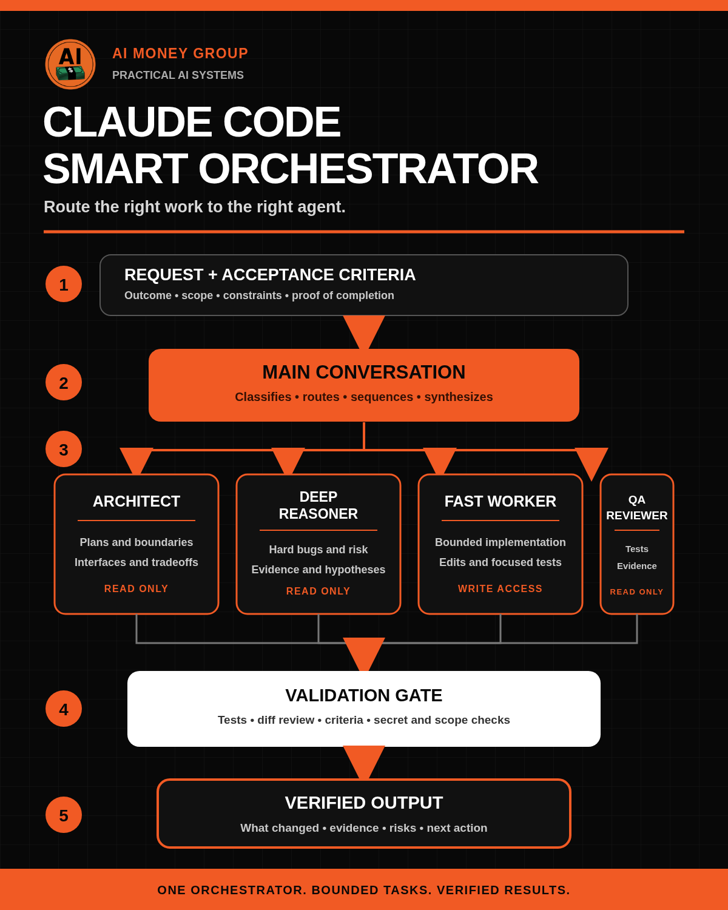

# Claude Code Smart Orchestrator

[](https://github.com/jeffjhunter/claude-code-smart-orchestrator/actions/workflows/ci.yml)
[](https://github.com/jeffjhunter/claude-code-smart-orchestrator/releases/latest)
[](LICENSE)

Route Claude Code work by role, model alias, and effort level - then verify
what actually ran. Version 2.1 adds Fable as an opt-in planning route without
replacing the proven Opus planner.

Version 2.1.1 separates the release into a lead-ready Giveaway ZIP and a
copy-ready Team Assets ZIP so the AI Money Group team never has to assemble,
strip, rename, or guess which files to send.



## Two clean release downloads

Every release is built into two audience-specific archives so nobody has to sort or remove files manually:

- **Giveaway:** the PDF guide, five-agent starter system, setup instructions, validators, adversarial tests, evidence, license, credits, and safety documentation. This is the only ZIP sent to leads.
- **Team Assets:** the social post, infographic, comment replies, delivery copy, launch checklist, and generated direct download links. This ZIP is for the AI Money Group team only.

Repository source, CI configuration, visual source files, and release tooling are intentionally excluded from both audience archives.

## Four proven lanes, plus an opt-in Fable planner

| Agent | Job | Model | Effort | Permission mode | Status |
|---|---|---:|---:|---:|---|
| `architect` | Plans, interfaces, tradeoffs, and sequencing | `opus` | `high` | `plan` | Default planner; live-trace observed |
| `deep-reasoner` | Ambiguous failures and high-consequence reasoning | `opus` | `xhigh` | `plan` | Default reasoner; live-trace observed |
| `fable-planner` | Long-horizon roadmaps, scenarios, and decision gates | `fable` | `xhigh` | `plan` | Opt-in; live-trace observed |
| `fast-worker` | Clear, bounded implementation | `haiku` | `low` | `default` | Default worker; live-trace observed |
| `qa-reviewer` | Independent review and exact supplied checks | `sonnet` | `high` | `default` | Default reviewer; live-trace observed |

These are configured targets, not permanent runtime guarantees. Model aliases,
account policy, permissions, and availability can change the observed route.

The coordinator keeps `architect` on Opus as the normal planning lane and does
not select Fable solely because a task is broad or strategic. Choose Fable only
when the user explicitly requests it by name or invokes
`@agent-fable-planner`, and after the environment passes the Fable preflight.
Fable requires Claude Code 2.1.170 or newer; 2.1.210 or newer is recommended.
If the alias is unavailable, rejected, or does not produce an attributable
delegated trace, fall back to `@agent-architect` or `@agent-deep-reasoner`.

## What v2.1 observed - and what that means

Version 2.0.0 was tested in a disposable repository with Claude Code 2.1.210.
Four explicit Agent calls produced linked Opus, Opus, Haiku, and Sonnet model
metadata respectively. The test also caught a real QA configuration defect:
plan mode blocked the required test command, so QA now uses default mode with a
strict exact-first-command/no-unapproved-variant prompt contract.

For v2.1, both a direct `fable` preflight and one explicit
`@agent-fable-planner` probe completed on Claude Code 2.1.210. The delegated
14-event foreground trace linked exactly one Agent call, the matching task,
`claude-fable-5` child-model and completion metadata, a completed notification,
and successful Agent and final results; the bundled strict verifier accepted
it. The copied pilot agent byte-matched the release candidate and performed one
allowed Read with no edits or command calls. That establishes an observed
Fable route for one account, environment, prompt, and moment. It is not a
benchmark or a promise that another run will resolve the same way, so capture
and verify your own trace before relying on the route.

Read [LIVE-TEST-RESULTS.md](LIVE-TEST-RESULTS.md) for the dated observations,
the defect-and-fix record, evidence hashes, costs, and limitations. Observed
trace metadata is not cryptographic proof, and one successful demo is not a
general quality or savings claim.

## Quick start

Do the first run in a disposable project or branch. Do not overwrite an
existing `CLAUDE.md` or `.claude/` directory.

```powershell
python -m pip install -r requirements-dev.txt
python -I starter/scripts/validate_kit.py
```

Python 3.10 or newer is required.

Then follow [starter/SETUP.md](starter/SETUP.md) to back up and deliberately
merge the project instructions and five agent files. The four established
routes continue to work without selecting Fable.

For a deterministic agent-invocation check, use an explicit mention:

```text
@agent-architect Inspect this repository read-only and return one risk.
```

After the documented Fable preflight, test the optional planner separately:

```text
@agent-fable-planner Turn this broad objective into a phased roadmap with decision gates. Inspect read-only; do not edit.
```

Capture CLI evidence and validate it separately:

```powershell
$trace = Join-Path $env:TEMP "ccso-architect-proof.jsonl"
claude -p "Use @agent-architect to inspect the project. Do not edit." `
  --output-format stream-json `
  --verbose `
  --no-session-persistence |
  Set-Content -LiteralPath $trace -Encoding utf8

python -I starter/scripts/verify_runtime_trace.py $trace `
  --expected-agent architect `
  --expected-model opus
```

An `OBSERVED TRACE PASS` verifies the supplied trace structure and linked
model metadata. Review the task output, commands, diff, and acceptance criteria
independently.

Before a proof run, record whether `CLAUDE_CODE_SUBAGENT_MODEL` and
`CLAUDE_CODE_EFFORT_LEVEL` are set without printing their values. They can
override the configured model and effort. The trace verifier checks model
metadata, not effective effort. Keep raw traces outside the repository and
delete or securely retain them after review.

## Included

- Five strict project-agent definitions in `starter/.claude/agents/`, including the opt-in Fable planner
- Parent routing guidance and model policy
- Deterministic direct-invocation prompts and probabilistic router evaluations
- A recursive strict validator with fail-closed structural gates, exact agent-body hashes, a heuristic secret scan, and adversarial tests
- Separate direct-model and delegated-Agent trace verifiers with UTF-8 and UTF-16 support
- Safe Windows setup, upgrade, merge, rollback, and uninstall guidance
- A 14-page PDF guide and editable HTML/SVG visual sources
- Separate deterministic Giveaway and Team Assets ZIPs with audience-specific manifests
- Generated copy-ready delivery links so the team never assembles or strips files manually
- Allowlisted deterministic release builder, checksums, coordinated commit marker, and trusted-source verifier

Start with [README-FIRST.md](README-FIRST.md). The complete visual guide is
[Claude-Code-Smart-Orchestrator-Kit.pdf](Claude-Code-Smart-Orchestrator-Kit.pdf).

## Safety and honest claims

Agent prompts, tool lists, and permission modes are guardrails, not an
operating-system sandbox. Shell checks can mutate caches, snapshots, lockfiles,
or source. Keep secrets out of prompts and traces, review commands before
approval, and use least-privilege credentials.

Routing can improve or worsen cost, latency, and quality. Measure it against a
consistent baseline instead of promising savings. See [SECURITY.md](SECURITY.md)
and [starter/MODEL-POLICY.md](starter/MODEL-POLICY.md).

The manifest, local validator, and body hashes are integrity checks relative to
this checkout. They are not an external signature or independent trust anchor.

## Credits and license

Built by Jeff J Hunter. Special thanks to Matt Farmer, whose
[Codex model-routing article](https://mattfarmer.ai/codex-model-routing) helped
inspire the experiment and whose encouragement supported this implementation.

Released under the [MIT License](LICENSE). See [CREDITS.md](CREDITS.md) for
project provenance and trademark context.
